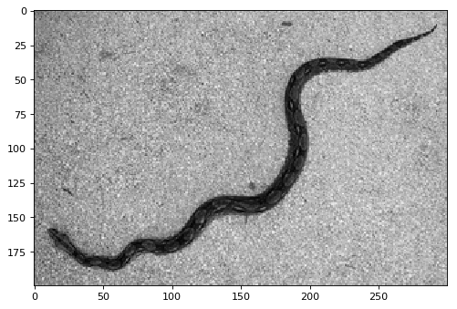
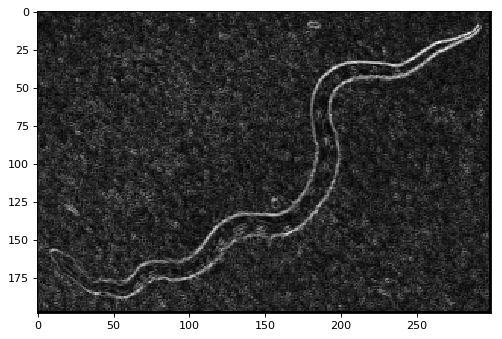
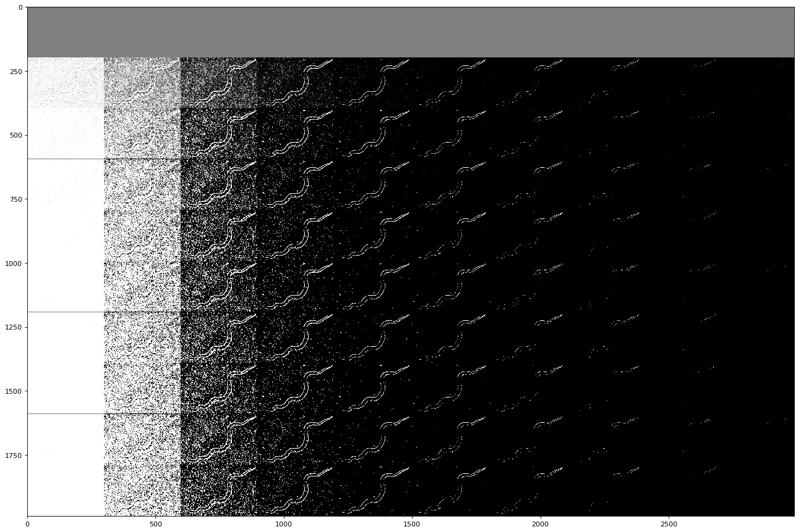
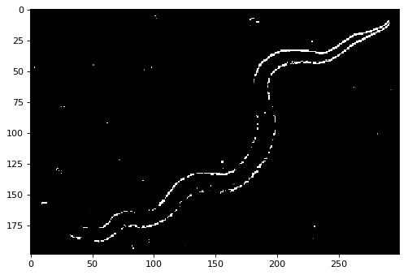
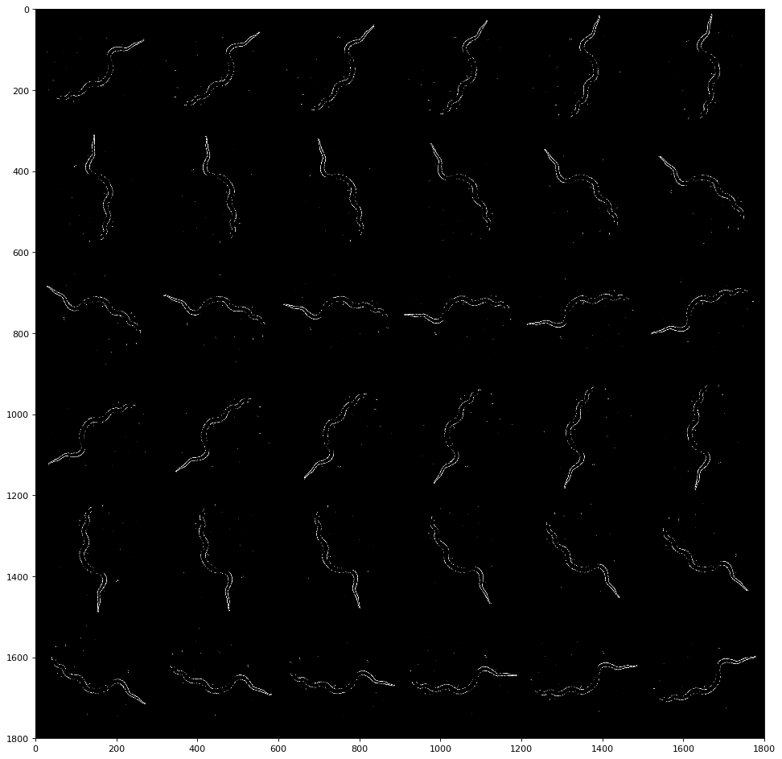
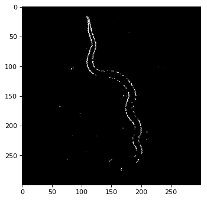
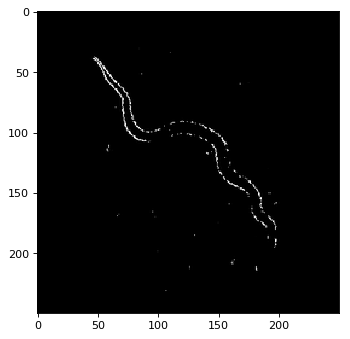
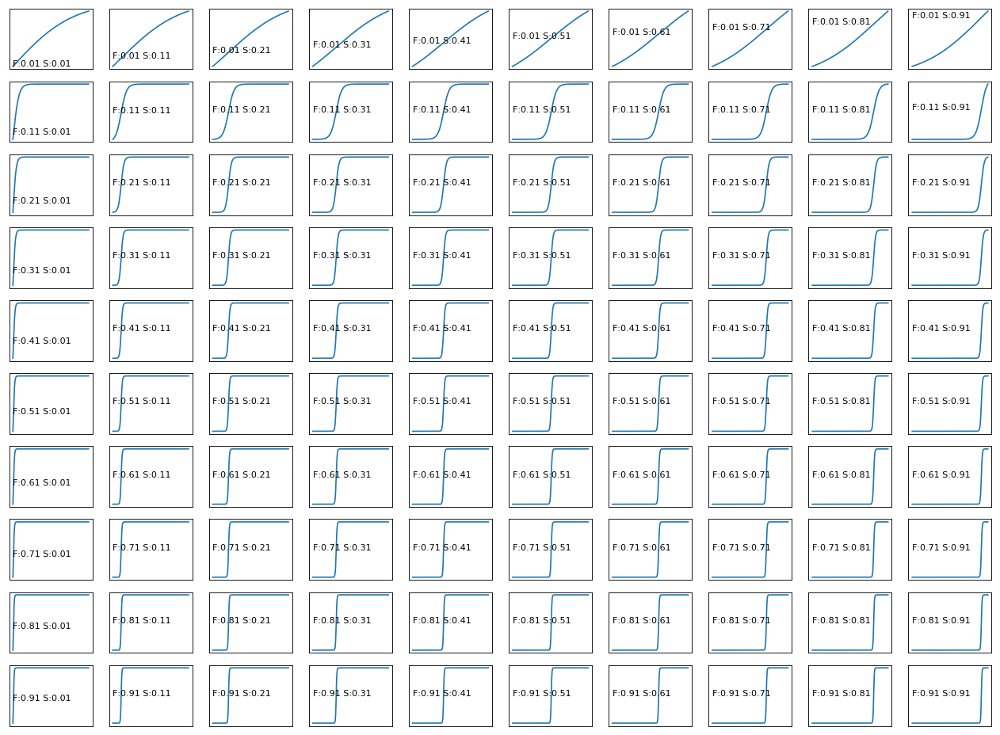
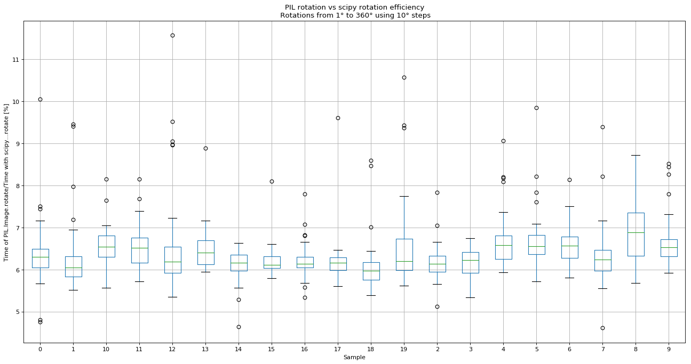

# Image processing for synthetic sample creation for training a classifier.

The samples created are based on grayscale transformation, border detection, noise reduction, rotation and  
resizing. The library provides you to perform all these operations just from a file location as input.  
You can get there transformations as output or a flatten numpy array with **n** rows and **m** columns.  
The **n** rows are based on the amount of rotations requested of the image. The **m** columns are the  
amount of pixels requested for the resize transformation of every sample, plus one column specified for  
the **target** class.

import common libraries


```python
from PIL import Image
from os import listdir
import sys
import imp
import pandas as pd
import matplotlib.pyplot as plt
import numpy as np
from scipy.ndimage.interpolation import rotate as sci_rotate
import time

```

import personal libraries


```python
sys.path.insert(0, 'MyLibraries')
import image_proc 
imp.reload(image_proc)

```

The following blocks list the images files frim a directory (**img_dir**).  
The files should in the format **Name-Of-Class_sn.jpg**.  
**sn** is the sample number for that class. The following will use the **_** to  
diferentiatiate the name of class from the sample name.   
Afterwards, a dataFrame is created with the fields **file, name, sample, target**.   
**name** is the class label and **target** the numeric value that will be used for  
training a classifier.


```python
img_dir = 'ImageDirectory'

img_file_list = list()
for f in sorted(listdir(img_dir)):
    fl = img_dir+'/'+f
    img_name=f.split('_')[0]
    sample_n = f.split('_')[1].split('.')[0]
    img_file_list.append({'name':img_name,'file':fl,'sample':sample_n})

img_df = pd.DataFrame(img_file_list).sort_values(by=['name','sample'])
target_names=sorted(list(set(img_df['name'].values)))
img_df['target']=img_df['name'].apply(lambda x: target_names.index(x))
```


```python
img_df
```


<div>
<table border="1" class="dataframe">
  <thead>
    <tr style="text-align: right;">
      <th></th>
      <th>file</th>
      <th>name</th>
      <th>sample</th>
      <th>target</th>
    </tr>
  </thead>
  <tbody>
    <tr>
      <th>0</th>
      <td>ImageDirectory/Boa-Constrictor-Imperator-From-...</td>
      <td>Boa-Constrictor-Imperator-From-Above</td>
      <td>1</td>
      <td>0</td>
    </tr>
  </tbody>
</table>
</div>


### Transform to gray scale and show

**imgToGray** will use PIL to read the image and use a transformation for rgb images to grayscale.  
Only images with 2 or 3 dimensions are accepted. A numpy array is returned  
**imgShow** plots the numpy array.


```python
img_x1 = img_df['file'].iloc[0]
np_sp_img_x1 = image_proc.imgToGray(img_x1)
image_proc.imgShow(np_sp_img_x1)
```





# Border detection

The function borderFilter returns a dictionary with numpy arrays.  
The keys of this dictionary are: ['y', 'xy', 'x', 'yx', 't']  
y: is the array with difference/derivative in the y axis  
x: the same concept in the x axis  
xy and yx : are these differences in the diagonal from the lower right corner to the upper left corner (xy) and  
from the lower left corner to the upper right corner (yx).  
t: is the sum of all these differences.


```python
x=image_proc.borderFilter(np_sp_img_x1)
image_proc.imgShow(x['t'])
```





### Noise removal

To erase noise and get the most remarkable borders we multiply the image for an exponential matrix.  
The shift (s) parameter moves the threshold towards to the hightest pixel intensity values (255)  
minimizing the value of everything below and increase everything above.  
The factor (f) paramenter makes this increase more drastic as this value gets to one.  
  
Since every picture may vary, this parameters must be tuned. Highly important during data exploration.


```python
npx_r = np.arange(0,1,0.1)
npx_s = npx_r.shape[0]
img_x = x['t']
img_xs = img_x.shape
xz = img_xs[0]
yz = img_xs[1]
npz = np.zeros((xz*npx_s,yz*npx_s))
for i,f in enumerate(npx_r):   
    for j,s in enumerate(npx_r):
        expx = image_proc.expFilter(img_x,factor=f,shift=s)
        npz[i*xz:(i+1)*xz,j*yz:(j+1)*yz]=expx
image_proc.imgShow(npz,figsize=(20,15),dpi=80)
```





```python
expx = image_proc.expFilter(img_x,factor=0.8,shift=0.5)
image_proc.imgShow(expx)
```





### Rotation of image

We also can generate more samples but with the a different orientation   
(Important for objectives that moves in a 2d plane).   
The function **rotateImage** creates a background image where to paste the  
rotated image and fill it with zeros.  This background is a squared matrix,  
therefore, it is easier to resize the image without losing the objective ratio.  
**resizeImg** resize the image to a width(w) and height(h)


```python
npx_r = np.arange(0,6,1)
npx_s = npx_r.shape[0]

rw=300
rh=300

xz = rw
yz = rh

npz = np.zeros((xz*npx_s,yz*npx_s))

for i,r in enumerate(npx_r):   
    for j,c in enumerate(npx_r):
        angle=(i*6+j)*10
        expxr = image_proc.rotateImage(img=expx,angle=angle)
        expxr = image_proc.resizeImg(expxr,w=rw,h=rh)
        npz[i*xz:(i+1)*xz,j*yz:(j+1)*yz]=expxr
image_proc.imgShow(npz,figsize=(20,15),dpi=80)
```





```python
expxr = image_proc.rotateImage(img=expx,angle=75)
expxr = image_proc.resizeImg(expxr,w=300,h=300)
image_proc.imgShow(expxr)
```





### All the previous processes at once

the function **dfFileTargetToArray** gets the filepath form a pandas dataframe in the field **file**  
and creates a group of numpy samples with the border detection using the **t** type.  Creates samples  
rotated according to the **rotateRange** param. **expFilterP** have the paremeters to the exponential filter.  
**v** if **True**, shows messages according to the progress. **plotAll** if **True** plots every image it  
goes creating. **rh** and **rw** are the heigth and width to resize the images.  
The ouput is an flatten numpy array with a +1 column, the target class from the **target** column specified  
in the dataframe.


```python
np_complete = image_proc.dfFileTargetToArray(img_df,rh=250,rw=250,v=False,plotAll=False,borderT='t',rotateRange=(0,360,10),expFilterP={'factor':0.8,'shift':0.5})
print(np_complete.shape)
#If you want to save your numpy array:
save_file = 'SaveDirectory/numpy_img_250x250.npy'
np.save(save_file,np_complete)

#To load the numpyarray
npx=np.load(save_file)
```

    (36, 62501)


```python
image_proc.imgShow(np.reshape(np_complete[10,:-1],(250,250)))
```





# Notes

## Exponential filter

To minimize noise with low magnitude in a picture, an exponential filter could transform intensities  
according to a threshold (TH). For this function, "Shift" (S) moves the transformation TH to the right as  
it increases. "Factor" (F) moves from a linear transformation to a step as it increases 


```python
x = np.arange(0,255,1)
exp_a = np.zeros((10,10))
xe = np.arange(0.01,1,0.1)

plt.figure(figsize=(20,15),dpi=80)

for i,f in enumerate(xe):
    for j,s in enumerate(xe):
        exp_x = image_proc.expFilter(x,factor=f,shift=s)
        plt.subplot(10,10,(i)*10+(j+1))
        plt.plot(x,exp_x)
        plt.text(0,128,"F:"+str(f)+" S:"+str(s))
        plt.xticks([])
        plt.yticks([])
        #plt.axis('off')
plt.show()

```





## Efficiency of Rotation of an image using PIL and scipy libraries

Using Pil rotation is more efficient than scipy's. image_proc.rotateImage uses PIl rotation  
  
image_proc.rotateImage(img_exp,angle=angle)  
scipy.ndimage.interpolation.rotate  


```python
plt.figure(figsize=(20,10),dpi=80)
figx = eff_df.boxplot()
plt.title('PIL rotation vs scipy rotation efficiency\n Rotations from 1° to 360° using 10° steps')
plt.ylabel("Time of PIL.Image.rotate/Time with scipy...rotate [%]")
plt.xlabel("Sample")
plt.show(figx)
```





# References

https://upload.wikimedia.org/wikipedia/commons/1/14/Boa-Constrictor-Imperator-From-Above.jpg
